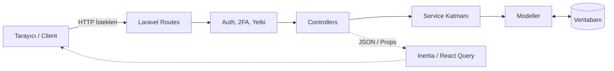

# Denti Platformu - Geliştirici Dokümantasyonu & Mimari Analiz Raporu

> [!NOTE]
> Bu doküman, Denti projesinin güncel durumunu, mimarisini ve kod tabanını özetleyen kapsamlı bir teknik başvuru kaynağıdır. Yeni geliştiricilerin projeye adaptasyon sürecini hızlandırmak ve mevcut teknik borçları listelemek amacıyla hazırlanmıştır.

## 1. Projeye Genel Bakış
Denti Platformu, diş klinikleri için stok, ürün, personel (role/yetki) ve görev (todo) yönetimini sağlayan kapsamlı bir SaaS (Software as a Service) projesidir. Sistem "Company" (Şirket/Klinik Ağı) ve alt "Clinic" (Şube) hiyerarşisiyle multi-tenant (çok kiracılı) bir yapıda çalışmaktadır.

**Mevcut Kod Durumu:** Proje üretim (production) aşamasına yakındır, ancak belirli yerlerde teknik borçlar ve güvenlik sıkılaştırmaları gerekmektedir. Laravel backend ağırlıklı olmakla birlikte, Inertia.js üzerinden modern bir React frontend mimarisine (React Query + Ant Design) sahiptir.

**Önerilen Ekip Yapısı:**
- 1 x Senior Full-stack Mimar (Sistem geneli, CI/CD, veritabanı optimizasyonu)
- 1 x Backend Geliştirici (Laravel servisleri, kuyruklar, raporlama uçları)
- 1 x Frontend Geliştirici (React componentleri, durum yönetimi, UI/UX)

---

## 2. Teknoloji Stack'i
- **Backend:** Laravel (v10/11), PHP 8.x
- **Frontend:** React, TypeScript, Inertia.js, Vite
- **UI Kütüphanesi:** Ant Design (v5+), Tailwind CSS
- **Veritabanı:** SQLite (Geliştirme), Production için PostgreSQL/MySQL
- **Kimlik Doğrulama:** Laravel Sanctum (Token ve Cookie tabanlı), İki Aşamalı Doğrulama (2FA)
- **State Management:** `@tanstack/react-query` (Veri çekme ve senkronizasyon), Zustand/Context (Lokal state)
- **Paket Yöneticileri:** Composer, npm

---

## 3. Mimari Genel Görünüm

Proje **Monolitik** bir yapıdadır. Laravel hem API sunucusu olarak hem de Inertia.js üzerinden frontend'i sunan sunucu olarak çalışır.

> [!TIP]
> **Tipik İstek Akışı (React Query API İsteği):** 
> 1. Frontend: `useStocks()` hook'u Axios ile `/api/stocks` adresine GET atar.
> 2. Backend: `api.php` -> `auth:sanctum` middleware -> `StockController@index`.
> 3. Controller: `StockService->getAllStocks()` çağrılır.
> 4. Service: Veritabanından `company_id` filtresi ile stokları çeker.
> 5. Sonuç JSON olarak React'a döner, React Query cache'e yazar, Tablo güncellenir.

---

## 4. Klasör & Dosya Yapısı (Açıklamalı)

- `/app/Http/Controllers/Api/`: Frontend'in React Query üzerinden konuştuğu ana API uçları. Her modülün (Stock, User, Role) kendi controller'ı vardır.
- `/app/Models/`: Veritabanı tablolarını temsil eden Eloquent modelleri. Neredeyse tamamı `company_id` içerir (Multi-tenant).
- `/app/Services/`: İş mantığının (Business Logic) tutulduğu sınıflar (Örn: `StockService`, `StockRequestService`). Fat-controller yapısından kaçınmak için kullanılmış, çok doğru bir pattern.
- `/app/Http/Middleware/`: Yetkilendirme (`SetPermissionsTeamId`), 2FA kontrolü (`EnsureTwoFactorIsVerified`) ve Inertia paylaşımlı veriler (`HandleInertiaRequests`).
- `/routes/api.php`: React Query uçlarının tanımlandığı yer. Tamamı `auth:sanctum` ile korunur.
- `/routes/web.php`: Sadece Inertia page render işlemlerini tutan yönlendirmeler.
- `/resources/js/Modules/`: Frontend'in ana damarı. Her domain (stock, auth, roles) kendi `Components`, `Hooks`, `Pages`, `Services` klasörlerine sahiptir (Domain-driven frontend design).
- `/resources/js/Pages/`: Inertia'nın başlangıç noktaları (Entry points). Çoğunlukla `Modules` altındaki sayfaları render eder.

---

## 5. Backend — Modeller & İlişkiler

Aşağıda temel modeller ve ilişkileri verilmiştir:

- **User (`users`)**: Sisteme giriş yapan kişi. 
  - *İlişkiler*: `belongsTo(Company)`, `belongsTo(Clinic)`.
- **Company (`companies`)**: Ana kiracı (Tenant). 
  - *İlişkiler*: `hasMany(User)`, `hasMany(Clinic)`, vb. Her şeyin tepesindedir.
- **Clinic (`clinics`)**: Şubeler.
  - *İlişkiler*: `belongsTo(Company)`, `hasMany(Stock)`.
- **Product (`products`)**: Katalogdaki ürün tanımları.
  - *İlişkiler*: `belongsTo(Company)`, `hasMany(Stock)`.
- **Stock (`stocks`)**: Belirli bir klinikteki spesifik ürün stoku.
  - *İlişkiler*: `belongsTo(Product)`, `belongsTo(Clinic)`, `belongsTo(Supplier)`.
- **StockTransaction (`stock_transactions`)**: Stok giriş/çıkış/kullanım kayıtları (Audit log).
- **StockRequest (`stock_requests`) & StockTransfer (`stock_transfers`)**: Klinikler arası stok transfer veya talep süreçleri.
- **StockAlert (`stock_alerts`)**: Azalan veya süresi dolan stoklar için sistem bildirimleri.

---

## 6. Backend — Route'lar & Controller'lar

Öne çıkan API Route'ları (`/api/*`):

| Method | URL | Auth | Controller | Ne Yapıyor | React Consumer |
|---|---|---|---|---|---|
| POST | `/login` | Hayır | `AuthController@login` | Kullanıcı girişi ve token üretimi | `LoginForm.tsx` |
| POST | `/auth/2fa/verify` | Evet | `TwoFactorAuthController@verify` | 2FA kod doğrulama | `useAuth.ts` |
| GET | `/stocks` | Evet | `StockController@index` | Stok listesini getirir | `useStocks.ts` |
| POST | `/stocks/{id}/adjust`| Evet | `StockController@adjustStock` | Stok seviyesini manuel düzeltme | `StockModals.tsx` |
| GET | `/products` | Evet | `ProductController@index` | Ürün kataloğunu çeker | `ProductForm.tsx` |
| GET | `/clinics` | Evet | `ClinicController@index` | Klinikleri listeler | `useClinics.ts` |
| GET | `/users` | Evet | `UserController@index` | Çalışan/Kullanıcı yönetimi | `useUsers.ts` |

> [!IMPORTANT]
> Route'lar sadece Sanctum ile değil, Spatie Permission kullanılarak `.middleware('permission:view-stocks')` şeklinde ekstra uç nokta güvenliği ile korunmaktadır.

---

## 7. Backend — Servisler & İş Mantığı

Sistemde controller'ları hafif tutmak için bir Service Layer mimarisi uygulanmıştır:

- **`StockService.php`**: Stok ekleme, kullanım (usage), düşme ve alt birim (sub_unit) hesaplamalarını yapar. Kritik metot: `adjustStock` ve `useStock`.
- **`StockRequestService.php`**: Klinikten kliniğe stok talep edilmesini, onaylanmasını ve `reserveStock` işlemleriyle stokların düşülmesini yönetir.
- **`StockAlertService.php`**: Süresi yaklaşan (`expiry_date`) veya kritik seviyeye inen ürünler için bildirim üretir.
- **`StockCalculatorService.php`**: Birim çevirileri ve fire/kullanım miktarlarını hesaplar.
- **`TwoFactorService.php`**: 2FA QR kod üretimi ve kod doğrulama işlemlerini encapsulate eder.

---

## 8. Frontend — Sayfalar & Componentler

Frontend "Feature-Sliced" veya "Domain-Driven" bir yapıya sahiptir. Tüm mantık `/Modules` klasöründedir.

- **`Stock/Pages/StocksPage.tsx`**: Stok yönetim ekranı.
  - *Veri Kaynağı:* `useStocks()` (React Query) hook'undan gelir.
  - *Kullanılan Componentler:* `StockTable`, `StockFilters`, `StockModals`, `StockStats`.
- **`Auth/Pages/LoginPage.tsx`**: Giriş sayfası.
  - *Veri Kaynağı:* Lokal state ve form validasyonları. API isteği `authApi.ts` üzerinden.
- **`Users/Pages/UserManagementPage.tsx`**: Personel yönetimi. Modal bazlı CRUD işlemleri içerir.
- **`Admin/Pages/CompanyManagementPage.tsx`**: Sadece Super Admin'in gördüğü, platformdaki şirketleri (tenantları) yönettiği ekran.

---

## 9. Frontend — State & Veri Akışı

1. **Global/Server State:** Tamamen `@tanstack/react-query` üzerine kuruludur. Her modülün `useX.ts` (örn: `useStocks.ts`) adında custom hook'ları vardır. Veri mutasyonlarında (ekleme/silme) query invalidate edilerek tabloların otomatik yenilenmesi sağlanır.
2. **Global/Client State:** Inertia.js'in `usePage().props` objesi üzerinden global `auth.user`, `auth.roles` ve `flash.message` gibi veriler okunur (Bkz: `HandleInertiaRequests.php`). Ayrıca `authStore.ts` (Zustand) üzerinden token ve session yönetimi yapıldığı görülmektedir.
3. **Local State:** Component içlerinde React `useState` kullanılarak form modallarının açık/kapalı durumları tutulur.

---

## 10. Auth & Güvenlik

- **Auth Akışı:** `AuthController` üzerinden token alınır. İsteğe bağlı 2FA aktifse kullanıcıdan 6 haneli kod istenir (`EnsureTwoFactorIsVerified` middleware'i).
- **Yetki Akışı (RBAC):** Spatie Laravel Permission paketi kullanılmıştır. Roller (Role) ve Yetkiler (Permission) veritabanında tutulur. Frontend'de UI elementleri `usePermissions` hook'u ile yetkiye göre gizlenir/gösterilir.
- **Tenant İzolasyonu:** BOLA (Broken Object Level Authorization) zafiyetlerini önlemek için `company_id` bazlı izolasyon sağlanmıştır. Ancak `UserController` veya `StockController` içinde `$user->company_id` kontrolünün eksiksiz yapıldığından emin olunmalıdır.
- **Güvenlik Riskleri:** 
  - `Mass Assignment` tehlikesine karşı Modellerde `$fillable` dizilerinin eksiksiz tanımlandığından emin olunmalı.
  - Silme işlemlerinde "Yetkisiz silme" açıklarına dikkat edilmeli, `delete` metodlarında modelin `company_id`'si ile Auth olan kullanıcının `company_id`'si mutlaka eşleştirilmelidir.

---

## 11. Environment Variables

`.env` dosyasında bulunması gereken temel değişkenler:

| Key | Zorunlu mu | Ne İşe Yarıyor | Örnek Değer |
|---|---|---|---|
| `APP_KEY` | Evet | Laravel şifreleme anahtarı | `base64:...` |
| `DB_CONNECTION` | Evet | Veritabanı sürücüsü | `sqlite` (Prod'da `mysql`/`pgsql`) |
| `FRONTEND_URL` | Evet | CORS ve yönlendirme için URL | `http://localhost:3000` |
| `SANCTUM_STATEFUL_DOMAINS`| Evet | Cookie tabanlı auth kabul edilecek domain | `localhost:3000` |
| `SESSION_DOMAIN` | Evet | Session cookie domain'i | `localhost` |
| `MAIL_MAILER` | Hayır | E-posta gönderim protokolü | `smtp` |
| `ALERT_EMAILS` | Hayır | Sistem kritik uyarı e-postaları | `admin@klinik.com` |

---

## 12. Dış Entegrasyonlar
- Mevcut durumda `.env` dosyasında `AWS_ACCESS_KEY_ID` (S3 Storage) tanımları vardır. Resim veya belge yükleme işlemlerinde (AWS S3) kullanılmaktadır.
- Raporlama veya Loglama için Laravel Telescope (`telescope_entries` tablosundan anlaşılacağı üzere) entegre edilmiştir. Sadece geliştirme ortamında kullanılması tavsiye edilir.

---

## 13. Bilinen Sorunlar & Teknik Borç

> [!WARNING]
> Aşağıdaki maddeler kod incelemesi sırasında tespit edilen ve sistem performansını/güvenliğini etkileyebilecek teknik borçlardır.

### Bu Hafta Düzeltilmeli (Kritik)
- **N+1 Query Problemleri:** Stok veya Ürün listeleri dönerken `with(['category', 'clinic'])` gibi Eager Loading kullanımları controller seviyesinde eksikse sistem veritabanına yüzlerce sorgu atar. Özellikle `StockController@index` incelenmelidir. (Efor: Küçük)
- **2FA State Loop (Sonsuz Döngü):** Geçmiş loglardan anlaşıldığı üzere, 2FA aktif olup doğrulanmamış bir kullanıcının Inertia yönlendirmelerinde sonsuz döngüye girme riski vardır. Middleware (`EnsureTwoFactorIsVerified`) istisnaları çok dikkatli test edilmelidir. (Efor: Orta)
- **Response Trait Eksikliği:** `php artisan route:list` komutunu dahi bozan `JsonResponseTrait` bulamama hatası (`StockTransferController.php:16`) derhal düzeltilmelidir. Sistemdeki kritik bir derleme hatasıdır. (Efor: Küçük)

### 1 Ay İçinde (Önemli)
- **Kaskad (Cascading) Soft-Delete:** Clinic, Supplier veya Product silindiğinde, onlara bağlı Stock'ların ve Transaction'ların constraint hatası vermemesi için `cascade` silme veya `softDelete` mimarisi tam olarak oturtulmalıdır. (Efor: Orta)
- **Frontend Hata Yönetimi (Error Boundaries):** `axios` interceptor var ancak React uygulamasının tamamen çökmemesi için ana layout seviyesinde `ErrorBoundary` komponentleri eklenmelidir. (Efor: Küçük)

### 3 Ay+ (Uzun Vadeli Refactor)
- **Veritabanı Değişikliği:** Geliştirme ortamındaki `SQLite`, concurrent (eşzamanlı) stok işlemlerinde (race condition) yetersiz kalacaktır. Stok düşme/ekleme gibi `database lock` gerektiren işlemlerde PostgreSQL'e geçilmeli ve `DB::transaction` blokları `lockForUpdate()` ile desteklenmelidir. (Efor: Büyük)

---

## 14. Yeni Geliştirici Rehberi

### Kurulum (Adım Adım)
1. Projeyi klonlayın ve klasöre girin.
2. `composer install` ve `npm install` komutlarını çalıştırın.
3. `.env.example` dosyasını `.env` olarak kopyalayın ve `APP_KEY` üretmek için `php artisan key:generate` çalıştırın.
4. Veritabanı için boş bir `database/database.sqlite` dosyası oluşturun ve `php artisan migrate --seed` ile tabloları/test verilerini kurun.
5. Vite sunucusunu `npm run dev`, Laravel sunucusunu `php artisan serve` ile ayağa kaldırın.
6. `http://localhost:8000` üzerinden erişim sağlayın.

### Sıfırdan Özellik Ekleme Rehberi (Pattern)
Eğer "Randevu (Appointment)" adında yeni bir modül yapacaksanız sırası:
1. `php artisan make:model Appointment -m` (Model ve Migration). Migration'a `company_id` eklemeyi UNUTMAYIN.
2. `php artisan make:controller Api/AppointmentController --api`.
3. `app/Services/AppointmentService.php` oluşturun. DB mantığını buraya yazın. (Veritabanı sorguları asla Controller'da olmamalı!)
4. `routes/api.php`'ye endpointleri kaydedin. (Middleware olarak `permission:view-appointments` vs. ekleyin).
5. Frontend: `resources/js/Modules/appointment/` klasörünü açın.
6. İçine `Services/appointmentApi.ts` (axios çağrıları), `Hooks/useAppointments.ts` (React Query) ve `Pages/AppointmentsPage.tsx` (UI) oluşturun.
7. `routes/web.php` üzerinden `Inertia::render('Appointment/Index')` tanımını yapın.

### Bu Projede Uygulanan Kurallar
- **FATAL HATA:** Controller içinden direkt `DB::table` veya çok karmaşık Eloquent sorgusu yazılmaz. Hepsi Service sınıflarına aktarılmalıdır.
- **İsimlendirme:** Frontend dosya isimleri PascalCase (`ProductForm.tsx`), klasör isimleri camelCase (`stockRequest`).
- **Güvenlik Kuralı:** Frontend'den gelen `company_id` KESİNLİKLE kabul edilmez. Her insert/update işleminde şirket kimliği server'da `Auth::user()->company_id` üzerinden atanmalıdır. BOLA (Broken Object Level Authorization) açıklarını önlemek için ID bazlı erişimlerde kullanıcının kendi kliniği/şirketi olup olmadığı mutlaka teyit edilmelidir.

---

## 15. Sözlük
- **Tenant / Company:** Sistemi kullanan ana müşteri (Örn: "Özel Gülüşler Ağız ve Diş Sağlığı Merkezi").
- **Clinic:** Ana müşteriye bağlı şubeler (Örn: "Kadıköy Şubesi").
- **Product:** Marka, model ve genel özellikleri olan soyut ürün tanımı (Örn: "Implant X-200").
- **Stock:** Belirli bir `Clinic` içindeki, belirli bir `Product`'ın sayılabilir/fiziksel varlığı.
- **Stock Request/Transfer:** Klinikler arası mal talebi ve transferi süreçleri.
- **BOLA:** Sisteme sızan bir kullanıcının, URL'deki ID'yi değiştirerek başka bir kliniğin verisine erişmeye çalışması (Bu proje için en büyük risk).
- **Inertia.js:** Laravel ve React arasında API/JSON katmanı kurmadan sayfa render edilmesini sağlayan köprü kütüphane.
